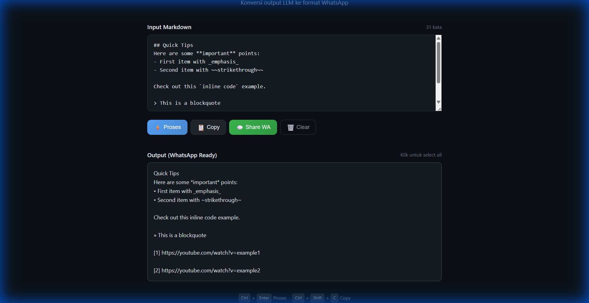

# MD2WA - Markdown to WhatsApp Converter

Convert markdown output from LLMs (ChatGPT, Claude, Gemini, Perplexity) to WhatsApp-friendly format.



## ✨ Features

- **Clean markdown formatting** - Removes headers, converts bold/italic to WhatsApp format
- **URL cleanup** - Removes tracking parameters (utm_*), AWS tokens from S3 URLs
- **Perplexity support** - Converts `[n](url)` citation format
- **Code handling** - Preserves code blocks and inline code
- **Auto spacing** - Adds proper line breaks between URL references
- **PWA ready** - Install as standalone app on mobile/desktop
- **Dark mode** - Modern GitHub-inspired dark theme
- **Keyboard shortcuts** - `Ctrl+Enter` to process, `Ctrl+Shift+C` to copy

## 🚀 Live Demo

Deploy your own instance using GitHub Pages or any static hosting.

## 📋 Conversion Rules

| Markdown Input | WhatsApp Output |
|----------------|-----------------|
| `## Heading` | `Heading` |
| `**bold**` | `*bold*` |
| `_italic_` | `_italic_` |
| `~~strike~~` | `~strike~` |
| `- item` | `• item` |
| `[text](url)` | `text (url)` |
| `[n](url)` | `[n] url` |
| `` `code` `` | `code` |
| `> quote` | `» quote` |
| `---` | `_____` |

## 🛠️ Installation

### Option 1: GitHub Pages
1. Fork this repository
2. Go to Settings → Pages
3. Set source to `main` branch
4. Access at `https://yourusername.github.io/md2wa/`

### Option 2: Self-hosted
1. Download/clone this repository
2. Upload to any web server
3. No build step required - it's just HTML/CSS/JS

## 📁 Project Structure

```
md2wa/
├── index.html      # Main HTML file
├── style.css       # Dark mode styles
├── app.js          # Conversion logic
├── manifest.json   # PWA manifest
├── sw.js           # Service worker for offline
└── icons/          # App icons
    ├── icon-192.png
    └── icon-512.png
```

## 🤝 Contributing

Contributions are welcome! Please read [CONTRIBUTING.md](CONTRIBUTING.md) for guidelines.

## 📄 License

This project is licensed under the MIT License - see the [LICENSE](LICENSE) file for details.

## 🙏 Acknowledgments

- Inspired by the need to share LLM outputs on WhatsApp cleanly
- Dark theme based on GitHub's color palette
